# AI Decisioning & Governance Engine - Complete Architecture

## Executive Summary

This document outlines the complete architecture for building a **user-level AI decisioning system** inspired by platforms like OfferFit, Aampe, and Hightouch. Unlike traditional campaign-level systems, this architecture operates at the **individual user level**, making personalized decisions for each user about:

- **Which offer** to present
- **Which channel** to use (SMS, WhatsApp, RCS, Push, In-App)
- **Which partner** to route to
- **When** to communicate
- **What creative** to show

> [!IMPORTANT]
> **Key Paradigm Shift**: Moving from **Campaign-Level** to **User-Level** decisioning
> 
> - **Current State**: Create segments → Launch campaigns → Users receive same treatment
> - **Target State**: Each user gets individual decision → System learns per-user → Continuous optimization

---

## Table of Contents

1. [System Overview](#system-overview)
2. [Current vs Target Architecture](#current-vs-target-architecture)
3. [User-Level Flow Design](#user-level-flow-design)
4. [Core Components](#core-components)
5. [Data Architecture](#data-architecture)
6. [Intelligence Layer](#intelligence-layer)
7. [Governance Layer](#governance-layer)
8. [Implementation Roadmap](#implementation-roadmap)
9. [Technical Stack](#technical-stack)
10. [Integration Points](#integration-points)

---

## System Overview

### Business Context

**Bajaj Markets** manages a digital marketplace with:
- **100M+ customers** across loans, credit cards, insurance, and investments
- **₹2 Cr/month** CRM spend across SMS, WhatsApp, RCS
- **30K+ daily new installs**, 1.8L DAU, 24L MAU
- **Multiple products** per customer (PL, CC, GL, HL, Insurance, etc.)
- **Multiple partners** for each product (top 5 JV partners prioritized)
- **Multiple channels** (SMS, RCS, WhatsApp, Push, In-App Nudges)

### Core Problem

Current system is **campaign-centric**:
1. Marketing team creates segments manually
2. Same campaign sent to all users in segment
3. No individual user learning
4. High overlap, user fatigue, rising COA
5. Fragmented governance across channels/products/funnels

### Target Solution

Build a **user-centric agentic system** that:
1. Makes decisions per individual user
2. Learns from every interaction per user
3. Optimizes across all dimensions (offer, channel, partner, timing)
4. Enforces unified governance automatically
5. Operates like OfferFit - continuous experimentation per user

---

## Current vs Target Architecture

### Current Architecture (Campaign-Level)

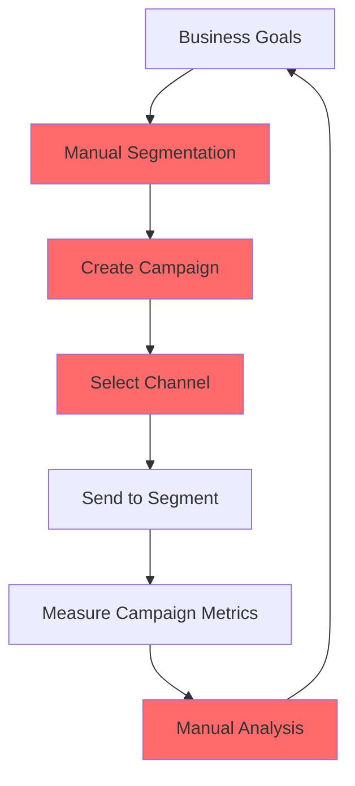

**Problems**:
- Manual segmentation → slow, static
- Same treatment for all users in segment
- No individual learning
- Reactive optimization

### Target Architecture (User-Level)

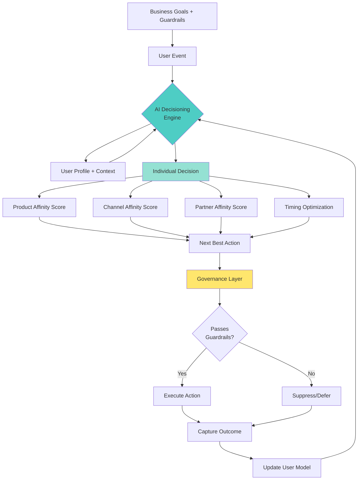

**Benefits**:
- Per-user decisions in real-time
- Continuous learning loop
- Multi-dimensional optimization
- Automated governance

---

## User-Level Flow Design

### How OfferFit-Style Systems Work

#### 1. User-Level Decision Making

Instead of: *"Create segment of users with CIBIL > 700 and send PL offer via SMS"*

Do: *"For User123, decide: Which offer? Which channel? When?"*

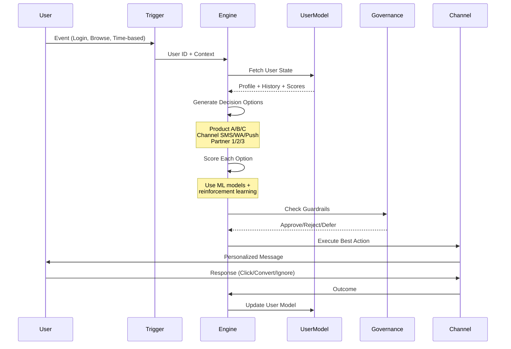

#### 2. Individual User Learning Loop

Each user has their own "learning agent":

```
User Profile = {
  demographics: {...},
  behavior_history: [...],
  channel_affinity: {
    sms: 0.3,
    whatsapp: 0.7,
    rcs: 0.5,
    push: 0.2
  },
  product_affinity: {
    personal_loan: 0.8,
    credit_card: 0.4,
    gold_loan: 0.6
  },
  partner_affinity: {
    federal: 0.7,
    fibe: 0.9,
    kisht: 0.5
  },
  recent_interactions: [...],
  fatigue_score: 0.3,
  conversion_probability: 0.45,
  lifetime_value: 15000
}
```

Every interaction updates this profile.

#### 3. Multi-Armed Bandit Approach

For each user, the system:

1. **Explores**: Try different combinations to learn preferences
2. **Exploits**: Use best-known combinations
3. **Balances**: ε-greedy or Thompson Sampling

Example for User123:
```
Options:
1. [PL Offer] → [WhatsApp] → [Federal Partner] → [Morning]
2. [CC Offer] → [SMS] → [Fibe Partner] → [Evening]
3. [GL Offer] → [RCS] → [Kisht Partner] → [Afternoon]

System scores each option:
Option 1: Score 0.78 (high confidence)
Option 2: Score 0.45 (medium confidence)
Option 3: Score 0.32 (low confidence, needs exploration)

Decision: 90% chance pick Option 1, 10% chance explore others
```

---

## Core Components

### 1. Identity Resolution Layer

**Purpose**: Maintain persistent user identity across channels and sessions

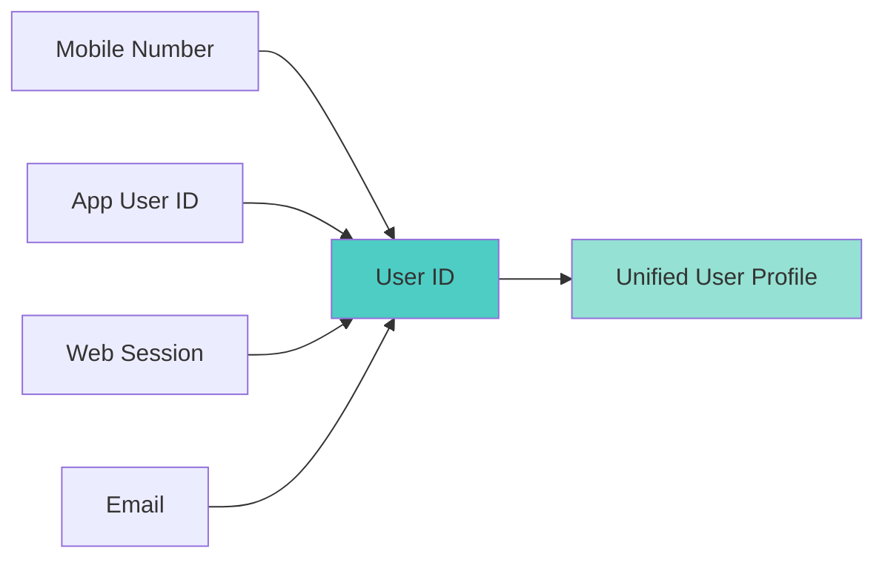

**Implementation**:
```python
class UserIdentity:
    user_id: str  # Primary identifier
    mobile: str
    app_id: str
    email: str
    device_ids: List[str]
    first_seen: datetime
    last_seen: datetime
    
    def merge_identities(self, other_identity):
        # Merge multiple identities into one
        pass
```

### 2. Signal Collection Layer

**Purpose**: Capture all user interactions and behaviors

**Real-time Signals**:
- User events (login, browse, click, form fill)
- Campaign interactions (open, click, convert, ignore)
- App behaviors (screen views, feature usage)
- Transaction events (lead, AIP, disbursement)

**Batch Signals**:
-  Bureau data (CIBIL score, credit history)
- C360 attributes (historical profile)
- Partner rejection history
- Offer eligibility from BRE

**Event Schema**:
```json
{
  "event_id": "evt_123456",
  "user_id": "user_789",
  "timestamp": "2024-12-01T10:30:00Z",
  "event_type": "campaign_delivered",
  "properties": {
    "campaign_id": "camp_456",
    "channel": "whatsapp",
    "offer_type": "personal_loan",
    "offer_amount": 500000,
    "partner": "federal",
    "creative_variant": "A"
  },
  "context": {
    "device": "mobile",
    "app_version": "3.2.1",
    "location": "Mumbai"
  }
}
```

### 3. Feature Store

**Purpose**: Compute and store ML features for each user

**Feature Categories**:

#### a) Product Affinity Features
```python
product_features = {
    # From UTM/Branch data
    'utm_source': 'google_pmax',
    'utm_campaign': 'personal_loan_tier1',
    'branch_campaign': 'pl_app_install',
    
    # From Adobe Analytics
    'product_page_views': {'pl': 5, 'cc': 2, 'gl': 0},
    'partner_page_clicks': {'federal': 3, 'fibe': 1},
    'time_on_product_page': 145,  # seconds
    
    # From Bureau Data
    'recent_enquiries': {'personal_loan': 2, 'credit_card': 1},
    'last_enquiry_date': '2024-11-15',
    'enquiry_frequency_30d': 3,
    
    # Computed
    'pl_affinity_score': 0.82,
    'cc_affinity_score': 0.45,
    'gl_affinity_score': 0.23
}
```

#### b) Channel Affinity Features
```python
channel_features = {
    # From Netcore + CPaaS
    'sms_open_rate': 0.35,
    'sms_click_rate': 0.12,
    'sms_last_interaction': '2024-11-28',
    
    'whatsapp_open_rate': 0.72,
    'whatsapp_click_rate': 0.45,
    'whatsapp_last_interaction': '2024-11-30',
    
    'rcs_open_rate': 0.55,
    'rcs_click_rate': 0.28,
    
    'push_open_rate': 0.18,
    'push_click_rate': 0.05,
    
    # Device preferences
    'preferred_device': 'mobile',
    'app_engagement_score': 0.67,
    
    # Time preferences
    'best_time_of_day': 'evening',
    'best_day_of_week': 'friday',
    
    # Computed
    'channel_affinity_rank': ['whatsapp', 'rcs', 'sms', 'push']
}
```

#### c) Partner Affinity Features
```python
partner_features = {
    # From Partner API logs
    'partner_history': {
        'federal': {'applied': 2, 'approved': 1, 'rejected': 1},
        'fibe': {'applied': 1, 'approved': 1, 'rejected': 0},
        'kisht': {'applied': 1, 'approved': 0, 'rejected': 1}
    },
    
    # From rejection data
    'recent_rejections': ['kisht_2024-11-20'],
    'rejection_reasons': {'low_cibil': 1, 'high_existing_loans': 1},
    
    # Computed affinity
    'partner_approval_probability': {
        'federal': 0.65,
        'fibe': 0.88,
        'kisht': 0.20
    },
    
    'partner_margin_score': {
        'federal': 0.75,
        'fibe': 0.90,
        'kisht': 0.65
    }
}
```

#### d) Eligibility Features
```python
eligibility_features = {
    # From BRE
    'bre_eligible_products': ['pl', 'bl', 'cc'],
    'bre_offer_amounts': {'pl': 500000, 'bl': 200000, 'cc': 100000},
    
    # From Credit Bureau
    'cibil_score': 745,
    'cibil_band': 'S1',  # S1-S4 buckets
    'existing_loans': 2,
    'total_debt': 350000,
    'dti_ratio': 0.35,
    
    # From DB
    'user_segment': 'ETP',
    'city_tier': 'tier1',
    'income_bracket': 'high',
    
    # Governance
    'dnc_status': false,
    'communication_consent': true,
    'last_campaign_date': '2024-11-25',
    'campaigns_last_7d': 3,
    'campaigns_last_30d': 12
}
```

#### e) Engagement Features
```python
engagement_features = {
    # App usage
    'app_opens_7d': 8,
    'app_opens_30d': 25,
    'session_duration_avg': 180,  # seconds
    'features_used': ['cibil_check', 'loan_calculator'],
    
    # Content engagement
    'credit_score_checks': 3,
    'offer_views': 12,
    'offer_applications_started': 2,
    'offer_applications_completed': 1,
    
    # Journey stage
    'current_stage': 'aip',  # anonymous, registered, lead, aip, disbursed
    'days_since_first_visit': 15,
    'days_since_last_lead': 5,
    
    # Computed
    'engagement_score': 0.68,
    'churn_risk': 0.25,
    'conversion_probability': 0.52
}
```

### 4. AI Decisioning Engine

**Purpose**: Make per-user decisions on next best action

This is the **heart of the system** - it operates like OfferFit's self-learning engine.

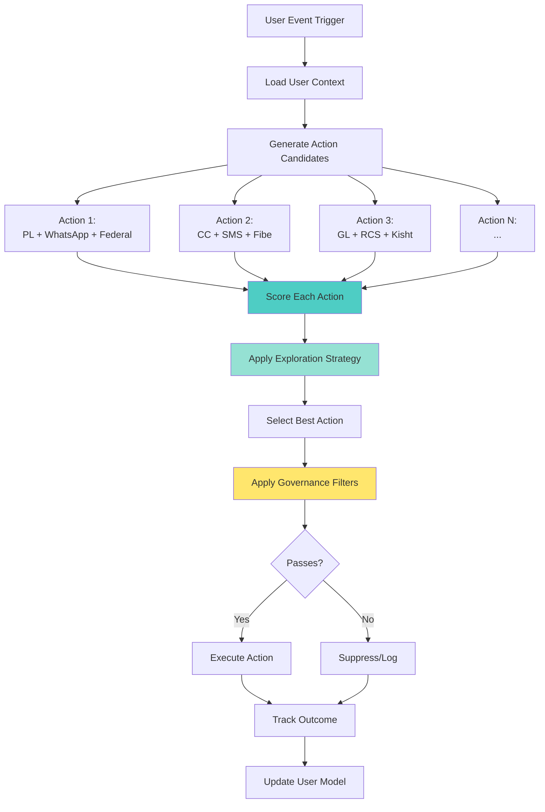

#### Scoring Algorithm

**Multi-Objective Optimization**:

```python
class DecisionScorer:
    def score_action(self, user_id, action):
        """
        Score a potential action for a user
        
        action = {
            'offer': 'personal_loan_500k',
            'channel': 'whatsapp',
            'partner': 'federal',
            'creative': 'variant_a',
            'timing': 'evening'
        }
        """
        user = self.feature_store.get_user(user_id)
        
        # Component scores
        product_score = self.score_product_affinity(user, action['offer'])
        channel_score = self.score_channel_affinity(user, action['channel'])
        partner_score = self.score_partner_affinity(user, action['partner'])
        timing_score = self.score_timing(user, action['timing'])
        creative_score = self.score_creative(user, action['creative'])
        
        # Conversion probability
        conversion_prob = self.predict_conversion(user, action)
        
        # Expected value
        revenue = self.get_expected_revenue(action)
        cost = self.get_channel_cost(action['channel'])
        
        # Multi-objective score
        score = (
            0.4 * conversion_prob +
            0.2 * (revenue - cost) / revenue +  # ROI component
            0.15 * product_score +
            0.15 * channel_score +
            0.05 * partner_score +
            0.05 * timing_score
        )
        
        # Exploration bonus (Thompson Sampling)
        uncertainty = self.get_action_uncertainty(user_id, action)
        exploration_bonus = self.sample_from_uncertainty(uncertainty)
        
        final_score = score + (self.exploration_rate * exploration_bonus)
        
        return {
            'score': final_score,
            'components': {
                'conversion_prob': conversion_prob,
                'product_score': product_score,
                'channel_score': channel_score,
                'partner_score': partner_score,
                'timing_score': timing_score,
                'creative_score': creative_score
            },
            'expected_value': revenue - cost,
            'confidence': 1 - uncertainty
        }
```

### 5. Governance Layer

**Purpose**: Enforce business rules and constraints

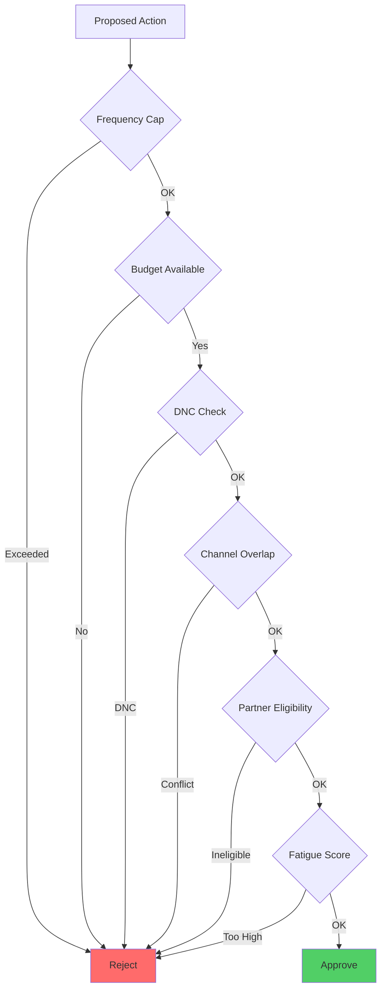

**Guardrails**:

```python
class GovernanceEngine:
    def check_guardrails(self, user_id, action):
        """Apply all governance rules"""
        
        # 1. Frequency Capping
        if self.check_frequency_cap(user_id, action):
            return {'approved': False, 'reason': 'frequency_cap_exceeded'}
        
        # 2. Budget Constraints
        if not self.check_budget_available(action):
            return {'approved': False, 'reason': 'budget_exhausted'}
        
        # 3. DNC / Consent
        if not self.check_consent(user_id, action['channel']):
            return {'approved': False, 'reason': 'no_consent'}
        
        # 4. Channel Overlap (don't send SMS and WhatsApp same day)
        if self.check_channel_conflict(user_id, action):
            return {'approved': False, 'reason': 'channel_overlap'}
        
        # 5. Partner Eligibility
        if not self.check_partner_eligible(user_id, action['partner']):
            return {'approved': False, 'reason': 'partner_rejected_recently'}
        
        # 6. Fatigue Score
        fatigue = self.calculate_fatigue(user_id)
        if fatigue > 0.7:
            return {'approved': False, 'reason': 'user_fatigue'}
        
        # 7. Product Overlap (don't send multiple loan offers same day)
        if self.check_product_conflict(user_id, action):
            return {'approved': False, 'reason': 'product_overlap'}
        
        # 8. Global Campaign Limits
        if self.check_daily_limit_reached(action):
            return {'approved': False, 'reason': 'daily_limit_reached'}
        
        return {'approved': True}
    
    def check_frequency_cap(self, user_id, action):
        """Check if user has received too many messages"""
        recent_messages = self.get_user_messages(user_id, days=7)
        
        caps = {
            'daily': 2,
            'weekly': 10,
            'monthly': 30
        }
        
        messages_today = len([m for m in recent_messages if m.days_ago == 0])
        messages_week = len([m for m in recent_messages if m.days_ago <= 7])
        
        return (messages_today >= caps['daily'] or 
                messages_week >= caps['weekly'])
```

### 6. Orchestration Layer

**Purpose**: Execute decisions across channels

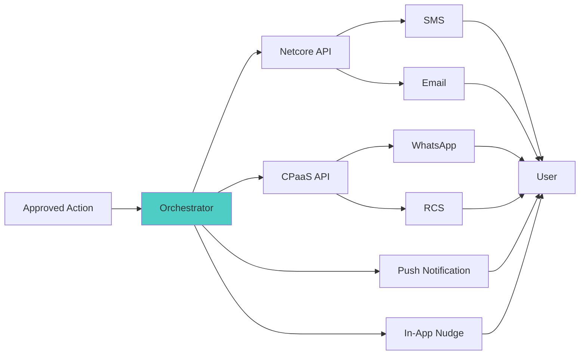

### 7. Measurement Layer

**Purpose**: Track outcomes and feed learning loop

```python
class OutcomeTracker:
    def track_action_outcome(self, action_id, user_id):
        """Track all outcomes for an action"""
        
        outcomes = {
            # Immediate metrics
            'delivered': self.check_delivered(action_id),
            'delivered_at': '2024-12-01T10:35:00Z',
            
            # Engagement metrics (tracked over time)
            'opened': False,
            'opened_at': None,
            'clicked': False,
            'clicked_at': None,
            
            # Conversion metrics
            'lead_created': False,
            'aip_achieved': False,
            'disbursed': False,
            
            # Attribution window
            'track_until': '2024-12-08T10:35:00Z',  # 7 days
            
            # Computed metrics
            'time_to_open': None,
            'time_to_click': None,
            'time_to_convert': None,
            
            # Cost
            'channel_cost': 0.50,  # WhatsApp message cost
            
            # Revenue (if converted)
            'revenue': 0,
            'margin': 0
        }
        
        # Update user model after outcome
        self.update_user_model(user_id, action_id, outcomes)
```

---

## Data Architecture

### Data Flow

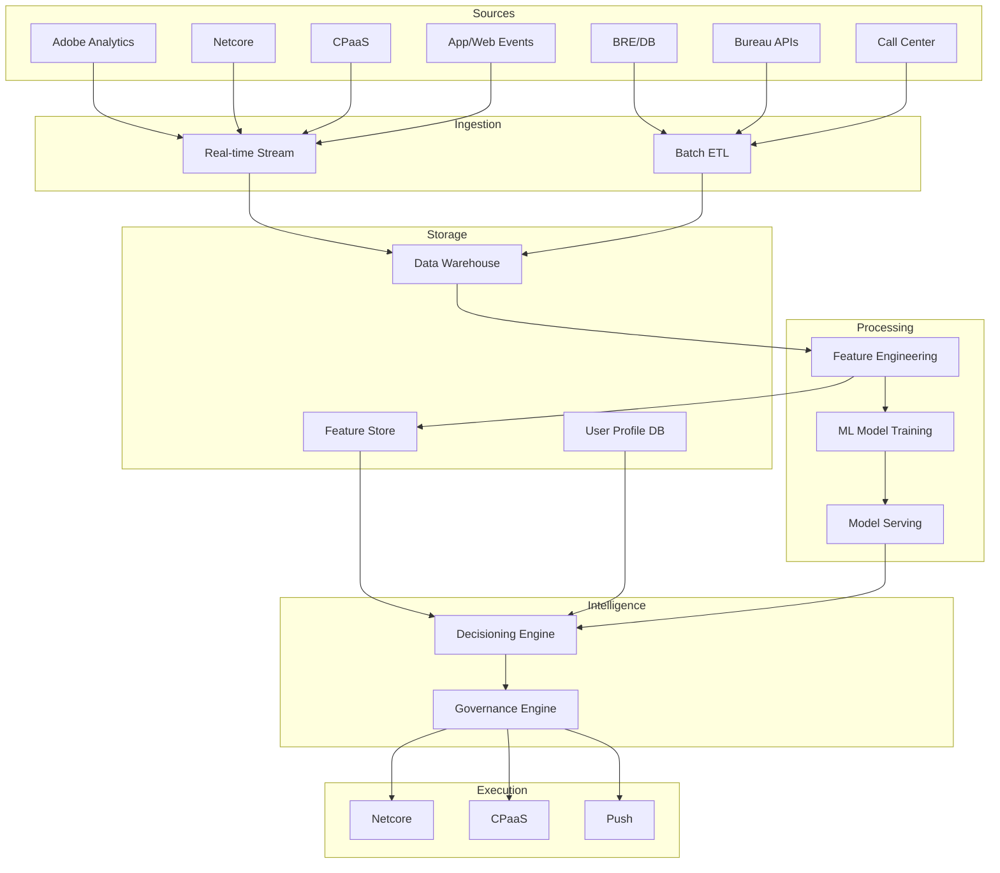

### Database Schema

#### Users Table
```sql
CREATE TABLE users (
    user_id VARCHAR(50) PRIMARY KEY,
    mobile VARCHAR(15) UNIQUE,
    email VARCHAR(100),
    first_seen TIMESTAMP,
    last_seen TIMESTAMP,
    current_stage VARCHAR(20),  -- anonymous, registered, lead, aip, disbursed
    
    -- Profile
    cibil_score INT,
    cibil_band VARCHAR(2),  -- S1, S2, S3, S4
    city VARCHAR(50),
    city_tier VARCHAR(10),
    income_bracket VARCHAR(20),
    
    -- Consent
    dnc_status BOOLEAN,
    sms_consent BOOLEAN,
    whatsapp_consent BOOLEAN,
    email_consent BOOLEAN,
    
    -- Computed scores
    engagement_score DECIMAL(3,2),
    churn_risk DECIMAL(3,2),
    lifetime_value DECIMAL(10,2),
    
    updated_at TIMESTAMP
);
```

#### User Features Table
```sql
CREATE TABLE user_features (
    user_id VARCHAR(50),
    feature_name VARCHAR(100),
    feature_value TEXT,
    feature_type VARCHAR(20),  -- numeric, categorical, array
    computed_at TIMESTAMP,
    expires_at TIMESTAMP,
    
    PRIMARY KEY (user_id, feature_name),
    FOREIGN KEY (user_id) REFERENCES users(user_id)
);

-- Examples:
-- (user123, 'pl_affinity_score', '0.82', 'numeric', ...)
-- (user123, 'channel_affinity_rank', '["whatsapp","rcs","sms"]', 'array', ...)
```

#### Actions Table
```sql
CREATE TABLE actions (
    action_id VARCHAR(50) PRIMARY KEY,
    user_id VARCHAR(50),
    campaign_id VARCHAR(50),
    
    -- Decision details
    offer_id VARCHAR(50),
    offer_type VARCHAR(50),  -- pl, cc, gl, etc.
    offer_amount DECIMAL(10,2),
    partner VARCHAR(50),
    channel VARCHAR(20),
    creative_variant VARCHAR(20),
    
    -- Scoring
    decision_score DECIMAL(5,4),
    conversion_prob DECIMAL(5,4),
    expected_value DECIMAL(10,2),
    exploration_flag BOOLEAN,
    
    -- Execution
    decided_at TIMESTAMP,
    executed_at TIMESTAMP,
    execution_status VARCHAR(20),
    
    -- Outcomes
    delivered BOOLEAN,
    opened BOOLEAN,
    clicked BOOLEAN,
    converted BOOLEAN,
    conversion_type VARCHAR(20),  -- lead, aip, disbursement
    
    -- Financials
    channel_cost DECIMAL(6,2),
    revenue DECIMAL(10,2),
    margin DECIMAL(10,2),
    
    FOREIGN KEY (user_id) REFERENCES users(user_id)
);
```

#### Governance Log Table
```sql
CREATE TABLE governance_log (
    log_id VARCHAR(50) PRIMARY KEY,
    user_id VARCHAR(50),
    action_id VARCHAR(50),
    
    check_type VARCHAR(50),  -- frequency_cap, budget, consent, etc.
    check_result VARCHAR(20),  -- passed, failed
    failure_reason TEXT,
    
    checked_at TIMESTAMP,
    
    FOREIGN KEY (user_id) REFERENCES users(user_id),
    FOREIGN KEY (action_id) REFERENCES actions(action_id)
);
```

#### User Journey Table
```sql
CREATE TABLE user_journey (
    journey_id VARCHAR(50) PRIMARY KEY,
    user_id VARCHAR(50),
    
    stage VARCHAR(20),  -- traffic, registered, lead, aip, disbursed
    entered_at TIMESTAMP,
    exited_at TIMESTAMP,
    
    source VARCHAR(50),  -- utm_source, branch, organic
    campaign VARCHAR(50),
    
    actions_received INT,
    actions_engaged INT,
    
    FOREIGN KEY (user_id) REFERENCES users(user_id)
);
```

---

## Intelligence Layer

### Machine Learning Models

#### 1. Conversion Prediction Model

**Purpose**: Predict probability of conversion (Lead, AIP, Disbursement)

```python
class ConversionPredictor:
    """
    Predicts P(conversion | user, action)
    
    Model: Gradient Boosting (XGBoost/LightGBM)
    Features: 100+ user and action features
    Target: Binary (converted or not)
    Training: Daily retraining on last 90 days
    """
    
    def predict_conversion(self, user_features, action_features):
        # Combine features
        X = self.engineer_features(user_features, action_features)
        
        # Get prediction
        prob = self.model.predict_proba(X)[0][1]
        
        return prob
    
    def engineer_features(self, user, action):
        return {
            # User features
            'cibil_score': user['cibil_score'],
            'engagement_score': user['engagement_score'],
            'days_since_first_visit': user['days_since_first_visit'],
            
            # Action features
            'offer_amount': action['offer_amount'],
            'channel': action['channel'],
            
            # Interaction features
            'user_channel_affinity': user[f"{action['channel']}_affinity"],
            'user_product_affinity': user[f"{action['offer_type']}_affinity"],
            
            # Historical features
            'past_conversions': user['past_conversions'],
            'last_campaign_response': user['last_campaign_response'],
            
            # ... 100+ features total
        }
```

#### 2. Channel Affinity Model

**Purpose**: Predict best channel for each user

```python
class ChannelAffinityModel:
    """
    Predicts P(engagement | user, channel)
    
    Model: Multi-class classifier or separate binary models per channel
    Features: Channel interaction history, demographics, device
    Target: Engagement (open, click)
    """
    
    def predict_channel_affinity(self, user_id):
        user = self.get_user(user_id)
        
        channels = ['sms', 'whatsapp', 'rcs', 'push', 'email']
        scores = {}
        
        for channel in channels:
            # Features specific to this channel
            features = {
                f'{channel}_open_rate': user.get(f'{channel}_open_rate', 0),
                f'{channel}_click_rate': user.get(f'{channel}_click_rate', 0),
                f'{channel}_last_interaction_days': user.get(f'{channel}_last_interaction_days', 999),
                'device': user['preferred_device'],
                'time_preference': user['best_time_of_day']
            }
            
            scores[channel] = self.model.predict(features)
        
        # Rank channels
        ranked = sorted(scores.items(), key=lambda x: x[1], reverse=True)
        
        return ranked
```

#### 3. Product Affinity Model

**Purpose**: Predict which product user is most interested in

```python
class ProductAffinityModel:
    """
    Predicts P(interest | user, product)
    
    Model: Recommendation-style (collaborative + content-based)
    Features: Browse behavior, UTM data, bureau enquiries
    Target: Product interest score
    """
    
    def predict_product_affinity(self, user_id):
        user = self.get_user(user_id)
        products = ['pl', 'cc', 'gl', 'hl', 'bl', 'insurance']
        
        scores = {}
        for product in products:
            features = {
                # Browsing behavior
                f'{product}_page_views': user.get(f'{product}_page_views', 0),
                f'{product}_time_spent': user.get(f'{product}_time_spent', 0),
                
                # Attribution
                'utm_campaign_product': user.get('utm_campaign', ''),
                
                # Bureau signals
                f'{product}_recent_enquiries': user.get(f'{product}_enquiries', 0),
                
                # Demographics
                'income_bracket': user['income_bracket'],
                'age_group': user['age_group'],
                
                # Existing products
                'has_existing_loan': user['has_existing_loan']
            }
            
            scores[product] = self.model.predict(features)
        
        return scores
```

#### 4. Partner Routing Model

**Purpose**: Predict best partner for conversion and margin

```python
class PartnerRoutingModel:
    """
    Predicts P(approval | user, partner) * expected_margin
    
    Model: XGBoost for approval prediction + business logic for margin
    Features: User credit profile, partner history, rejection history
    Target: Approval probability
    """
    
    def predict_partner_match(self, user_id, product):
        user = self.get_user(user_id)
        partners = self.get_partners_for_product(product)
        
        scores = {}
        for partner in partners:
            # Check if user was recently rejected
            if self.recently_rejected(user_id, partner):
                scores[partner] = 0
                continue
            
            # Approval probability
            approval_prob = self.predict_approval(user, partner)
            
            # Expected margin (from partner config)
            margin = self.get_partner_margin(partner, product)
            
            # Combined score
            scores[partner] = approval_prob * margin
        
        return scores
```

#### 5. Reinforcement Learning Agent

**Purpose**: Continuous learning and exploration

```python
class ReinforcementLearningAgent:
    """
    Thompson Sampling for balancing exploration/exploitation
    
    For each user-action pair, maintain:
    - Success count (conversions)
    - Failure count (no conversion)
    - Beta distribution parameters
    """
    
    def __init__(self):
        self.alpha = {}  # Success counts
        self.beta = {}   # Failure counts
    
    def select_action(self, user_id, actions):
        """Select action using Thompson Sampling"""
        
        samples = {}
        for action in actions:
            key = self.get_key(user_id, action)
            
            # Get Beta distribution parameters
            alpha = self.alpha.get(key, 1)  # Prior: alpha=1
            beta = self.beta.get(key, 1)    # Prior: beta=1
            
            # Sample from Beta distribution
            sample = np.random.beta(alpha, beta)
            samples[action] = sample
        
        # Select action with highest sample
        best_action = max(samples, key=samples.get)
        
        return best_action
    
    def update_belief(self, user_id, action, converted):
        """Update after observing outcome"""
        key = self.get_key(user_id, action)
        
        if converted:
            self.alpha[key] = self.alpha.get(key, 1) + 1
        else:
            self.beta[key] = self.beta.get(key, 1) + 1
    
    def get_key(self, user_id, action):
        """Create unique key for user-action pair"""
        return f"{user_id}_{action['offer']}_{action['channel']}_{action['partner']}"
```

---

## Governance Layer

### Multi-Dimensional Governance

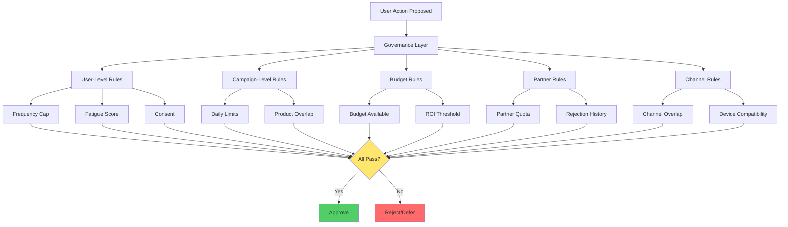

### Governance Rules Configuration

```yaml
# governance_rules.yaml

user_level_rules:
  frequency_caps:
    daily: 2
    weekly: 10
    monthly: 30
  
  fatigue_threshold: 0.7  # 0-1 scale
  
  channel_spacing:
    same_channel: 24h
    different_channel: 6h
  
  product_spacing:
    same_product: 7d
    different_product: 1d

campaign_level_rules:
  daily_send_limit: 1000000
  
  product_overlap_prevention:
    - [pl, bl]  # Don't send PL and BL same day
    - [cc, emi_card]
  
  attribution_window: 7d

budget_rules:
  daily_budget: 70000  # INR
  monthly_budget: 2000000
  
  channel_allocation:
    whatsapp: 40%
    sms: 30%
    rcs: 20%
    push: 10%
  
  roi_threshold: 1.5  # Expected value must be 1.5x cost

partner_rules:
  rejection_cooldown: 90d
  
  partner_quotas:
    federal: 1000/day
    fibe: 1500/day
    kisht: 800/day
  
  top_partners: [federal, fibe, kisht, payu, kb]

channel_rules:
  whatsapp:
    requires_consent: true
    requires_template: true
    cost_per_message: 0.50
  
  sms:
    requires_consent: false
    requires_dlt: true
    cost_per_message: 0.20
  
  rcs:
    requires_consent: true
    requires_device_support: true
    cost_per_message: 0.35
```

---

## Implementation Roadmap

### Phase 1: Foundation (Months 1-2)

**Goal**: Set up data infrastructure and basic decisioning

#### Sprint 1-2: Data Pipeline
- [x] Set up data warehouse (Snowflake/BigQuery/Redshift)
- [x] Implement event streaming (Kafka/Kinesis)
- [x] Build ETL pipelines from all sources
  - Adobe Analytics
  - Netcore
  - CPaaS (Karix, Infobip)
  - BRE/DB
  - Bureau APIs
- [x] Create unified user profile schema
- [x] Implement identity resolution

#### Sprint 3-4: Feature Store
- [x] Build feature engineering pipeline (DBT/Spark)
- [x] Implement feature store (Feast/Tecton or custom)
- [x] Create initial feature set:
  - Product affinity features
  - Channel affinity features
  - Partner affinity features
  - Eligibility features
  - Engagement features
- [x] Set up feature refresh schedules

#### Deliverables:
- Data warehouse operational
- Real-time + batch data flowing
- Unified user profiles available
- ~50 features computed per user

---

### Phase 2: Intelligence (Months 3-4)

**Goal**: Build ML models and basic decisioning

#### Sprint 5-6: Model Development
- [x] Train conversion prediction model
- [x] Train channel affinity model
- [x] Train product affinity model
- [x] Implement model serving infrastructure
- [x] Build A/B testing framework

#### Sprint 7-8: Decisioning Engine V1
- [x] Build decision scoring logic
- [x] Implement rule-based decisioning (pre-ML)
- [x] Create API for decision requests
- [x] Build simple exploration strategy (ε-greedy)

#### Deliverables:
- 3 core ML models deployed
- Decision API operational
- Able to score actions for users
- Basic online testing capability

---

### Phase 3: Orchestration (Months 5-6)

**Goal**: Execute decisions and close the loop

#### Sprint 9-10: Integration
- [x] Integrate with Netcore API
- [x] Integrate with CPaaS APIs
- [x] Build action execution service
- [x] Implement outcome tracking
- [x] Create feedback loop to update models

#### Sprint 11-12: Governance
- [x] Build governance engine
- [x] Implement all guardrails
- [x] Create governance UI for configuration
- [x] Add override mechanisms for manual control

#### Deliverables:
- End-to-end flow operational
- Governance enforced automatically
- Outcomes tracked and models updating
- Dashboard for monitoring

---

### Phase 4: Optimization (Months 7-9)

**Goal**: Advanced learning and optimization

#### Sprint 13-14: Reinforcement Learning
- [x] Implement Thompson Sampling
- [x] Add contextual bandits
- [x] Build per-user learning agents
- [x] Optimize exploration/exploitation balance

#### Sprint 15-16: Advanced Features
- [x] Add timing optimization
- [x] Implement creative optimization
- [x] Build partner routing optimization
- [x] Add budget allocation optimization

#### Sprint 17-18: Scale \u0026 Performance
- [x] Optimize for 100M+ users
- [x] Implement caching strategies
- [x] Add real-time processing
- [x] Performance testing and tuning

#### Deliverables:
- Full RL agent operational
- Advanced optimization features
- System handling full scale
- Sub-100ms decision latency

---

### Phase 5: Automation (Months 10-12)

**Goal**: Full automation and self-service

#### Sprint 19-20: Campaign Automation
- [x] Build brief automation (from goals → campaigns)
- [x] Implement journey automation
- [x] Create segment auto-generation
- [x] Add creative auto-selection

#### Sprint 21-22: Reporting \u0026 Analytics
- [x] Build comprehensive dashboards
- [x] Implement attribution modeling
- [x] Create ROI tracking
- [x] Add explainability features

#### Sprint 23-24: Self-Service UI
- [x] Build campaign planning interface
- [x] Create "AI Copilot" for marketers
- [x] Implement what-if scenarios
- [x] Add goal-based campaign creator

#### Deliverables:
- Fully automated system
- Self-service UI for marketers
- Complete analytics suite
- Measurable ROI improvement

---

## Technical Stack

### Recommended Technology Stack

#### Data Layer
```yaml
data_warehouse: Snowflake
streaming_platform: Apache Kafka / AWS Kinesis
feature_store: Feast / Tecton
data_processing: Apache Spark / dbt
identity_resolution: Segment / Custom
```

#### ML Layer
```yaml
training:
  framework: Python / Scikit-learn / XGBoost / LightGBM
  experimentation: MLflow / Weights \u0026 Biases
  
serving:
  model_serving: AWS SageMaker / Seldon / Custom FastAPI
  inference: Real-time (REST API) + Batch
  
features:
  online_store: Redis / DynamoDB
  offline_store: Snowflake / S3
```

#### Application Layer
```yaml
backend:
  api: FastAPI / Node.js
  language: Python / TypeScript
  
decisioning_engine:
  language: Python
  libraries: 
    - numpy / pandas (data manipulation)
    - scikit-learn (ML)
    - vowpal_wabbit (online learning)
  
database:
  operational: PostgreSQL
  caching: Redis
  user_profiles: MongoDB / DynamoDB
  
messaging:
  queue: RabbitMQ / AWS SQS
  pubsub: Kafka / AWS SNS
```

#### Infrastructure
```yaml
cloud: AWS / GCP / Azure
containers: Docker
orchestration: Kubernetes
ci_cd: GitHub Actions / GitLab CI
monitoring: Datadog / Prometheus + Grafana
logging: ELK Stack / CloudWatch
```

#### Frontend (Dashboard)
```yaml
framework: React / Next.js
charting: Recharts / D3.js
ui_library: Tailwind CSS / Material-UI
```

---

## Integration Points

### 1. Adobe Analytics Integration

```python
class AdobeAnalyticsConnector:
    """
    Pull behavioral data from Adobe Analytics
    """
    
    def fetch_user_behavior(self, user_id, days=30):
        """Get user clickstream and events"""
        
        query = f"""
        SELECT 
            event_timestamp,
            event_name,
            page_url,
            product_viewed,
            partner_clicked,
            session_duration,
            device_type
        FROM adobe_analytics.events
        WHERE user_id = '{user_id}'
        AND event_timestamp >= CURRENT_DATE - INTERVAL '{days}' DAY
        ORDER BY event_timestamp DESC
        """
        
        events = self.execute_query(query)
        
        # Aggregate into features
        features = {
            'product_page_views': self.count_product_views(events),
            'partner_page_clicks': self.count_partner_clicks(events),
            'avg_session_duration': self.avg_session_duration(events),
            'preferred_device': self.get_preferred_device(events),
            'last_visit_date': events[0]['event_timestamp'] if events else None
        }
        
        return features
```

### 2. Netcore Integration

```python
class NetcoreConnector:
    """
    Integration with Netcore for:
    - Fetching user properties
    - Getting campaign interaction history
    - Executing campaigns
    """
    
    def get_user_properties(self, user_id):
        """Fetch user properties from Netcore"""
        
        response = self.api_client.get(
            f'/v1/users/{user_id}/properties'
        )
        
        return response.json()
    
    def get_campaign_history(self, user_id, days=90):
        """Get user's campaign interaction history"""
        
        response = self.api_client.get(
            f'/v1/users/{user_id}/campaigns',
            params={'days': days}
        )
        
        campaigns = response.json()
        
        # Aggregate channel affinity
        channel_stats = {
            'sms': {'sent': 0, 'opened': 0, 'clicked': 0},
            'whatsapp': {'sent': 0, 'opened': 0, 'clicked': 0},
            'email': {'sent': 0, 'opened': 0, 'clicked': 0},
            'push': {'sent': 0, 'opened': 0, 'clicked': 0}
        }
        
        for campaign in campaigns:
            channel = campaign['channel']
            if channel in channel_stats:
                channel_stats[channel]['sent'] += 1
                if campaign['opened']:
                    channel_stats[channel]['opened'] += 1
                if campaign['clicked']:
                    channel_stats[channel]['clicked'] += 1
        
        return channel_stats
    
    def execute_campaign(self, user_id, action):
        """Send campaign through Netcore"""
        
        payload = {
            'user_id': user_id,
            'channel': action['channel'],
            'template_id': action['template_id'],
            'personalization': {
                'offer_amount': action['offer_amount'],
                'partner_name': action['partner'],
                # ... other dynamic fields
            }
        }
        
        response = self.api_client.post(
            '/v1/campaigns/send',
            json=payload
        )
        
        return response.json()
```

### 3. CPaaS Integration (Karix/Infobip)

```python
class CPaaSConnector:
    """
    Direct integration with CPaaS for WhatsApp/RCS
    """
    
    def send_whatsapp(self, user_id, message):
        """Send WhatsApp message"""
        
        user = self.get_user(user_id)
        
        payload = {
            'to': user['mobile'],
            'type': 'template',
            'template': {
                'name': message['template_name'],
                'language': 'en',
                'components': message['components']
            }
        }
        
        response = self.api_client.post(
            '/v1/messages',
            json=payload,
            headers={'Authorization': f'Bearer {self.api_key}'}
        )
        
        return response.json()
```

### 4. BRE/DB Integration

```python
class BREConnector:
    """
    Fetch offer eligibility from Business Rules Engine
    """
    
    def get_eligible_offers(self, user_id):
        """Query BRE for eligible offers"""
        
        user_data = self.get_user_data(user_id)
        
        response = self.bre_api.post(
            '/evaluate',
            json={'user': user_data}
        )
        
        offers = response.json()['eligible_offers']
        
        return offers
```

### 5. Bureau API Integration

```python
class BureauConnector:
    """
    Fetch credit bureau data
    """
    
    def get_credit_report(self, user_id):
        """Fetch CIBIL report for user"""
        
        user = self.get_user(user_id)
        
        # Call bureau API
        response = self.bureau_api.post(
            '/credit-report',
            json={
                'pan': user['pan'],
                'mobile': user['mobile'],
                'name': user['name'],
                'dob': user['dob']
            }
        )
        
        report = response.json()
        
        # Extract key features
        features = {
            'cibil_score': report['score'],
            'total_accounts': report['total_accounts'],
            'active_loans': report['active_loans'],
            'recent_enquiries_30d': report['enquiries_30d'],
            'recent_enquiries_90d': report['enquiries_90d'],
            'product_enquiries': report['product_wise_enquiries'],
            'credit_utilization': report['credit_utilization'],
            'delinquency_status': report['delinquency']
        }
        
        return features
```

---

## System Flow Examples

### Example 1: New User Journey (ETP - Existing to Platform)

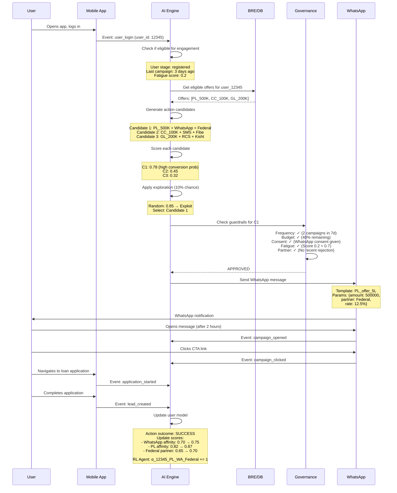

**Outcome**: User converted to lead through WhatsApp outreach with PL offer routed to Federal partner.

---

### Example 2: NTP (New To Platform) Cold Start

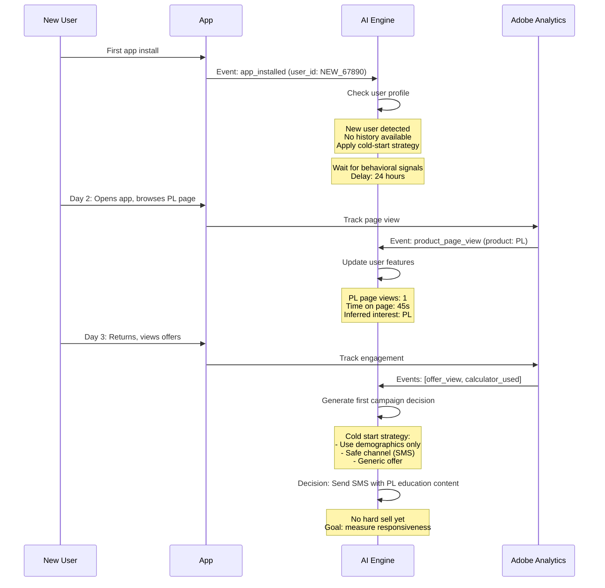

---

### Example 3: Governance Blocking Scenario

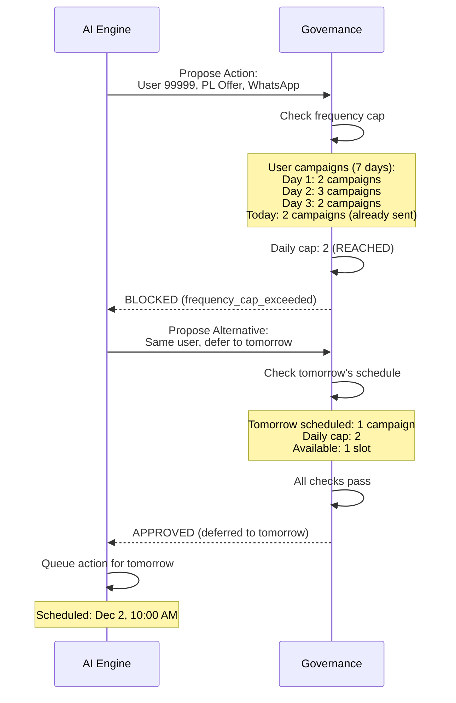

---

## Key Differences: Campaign-Level vs User-Level

| Aspect | Campaign-Level (Current) | User-Level (Target - OfferFit Style) |
|--------|--------------------------|--------------------------------------|
| **Decision Unit** | Segment (1000s of users) | Individual user |
| **Personalization** | Same message to segment | Unique decision per user |
| **Learning** | Post-campaign analysis | Real-time per-user learning |
| **Optimization** | A/B test campaigns | Continuous multi-armed bandit |
| **Segmentation** | Manual, static rules | Dynamic, ML-based |
| **Channel Selection** | Marketer decides | AI decides per user |
| **Timing** | Batch sends | Event-triggered + optimal timing |
| **Governance** | Manual suppression lists | Automated, real-time guardrails |
| **Experimentation** | Episodic A/B tests | Always-on exploration |
| **Feedback Loop** | Weekly/monthly reviews | Immediate after each interaction |

---

## Success Metrics

### North Star Metrics

1. **AIP Conversion Rate** ↑ 15-25%
2. **Cost of Acquisition (COA)** ↓ 10-20%
3. **Click-Through Rate (CTR)** ↑ 20-30%
4. **User Engagement Score** ↑ 15%
5. **App Uninstall Rate** ↓ 10%

### Operational Metrics

- **Decision Latency**: < 100ms
- **Model Accuracy**: > 80% precision on conversion prediction
- **Governance Compliance**: 100% (zero violations)
- **Channel Cost Efficiency**: Improve by 15%
- **Partner Approval Rate**: Increase by 10%

### Learning Metrics

- **Exploration Rate**: Maintain 5-10%
- **Model Drift Detection**: Weekly monitoring
- **Feature Importance**: Track changes monthly
- **User Model Confidence**: Track per user

---

## Next Steps

### Immediate Actions (Week 1-2)

1. **Data Audit**: Validate all data sources are accessible
2. **Schema Design**: Finalize database schemas
3. **Infrastructure Setup**: Provision cloud resources
4. **Team Assembly**: Assign roles (ML engineers, data engineers, backend devs)

### Quick Wins (Month 1)

1. **Pilot Program**: Run user-level decisioning for 10K users
2. **A/B Test**: Compare user-level vs campaign-level approach
3. **Channel Optimization**: Start with channel selection only
4. **Dashboard**: Build monitoring dashboard

### Foundation (Month 2-3)

1. **Feature Pipeline**: Build complete feature engineering
2. **ML Models**: Train and deploy first models
3. **Governance**: Implement all guardrails
4. **Integration**: Connect all data sources

---

## Conclusion

This architecture transforms Bajaj Markets' CRM from a **campaign-first** to a **user-first** system, operating like OfferFit and other modern AI decisioning platforms.

**Key Principles**:
1. ✅ **User-Level Decisions**: Every user gets individualized treatment
2. ✅ **Continuous Learning**: System learns from every interaction
3. ✅ **Multi-Dimensional Optimization**: Offer × Channel × Partner × Timing
4. ✅ **Automated Governance**: Rules enforced automatically
5. ✅ **Exploration + Exploitation**: Balance trying new things with using what works

The result is a **self-learning, self-optimizing engagement system** that improves with every user interaction while maintaining business guardrails.

---

**Document Version**: 1.0  
**Last Updated**: December 1, 2024  
**Status**: Ready for Implementation
